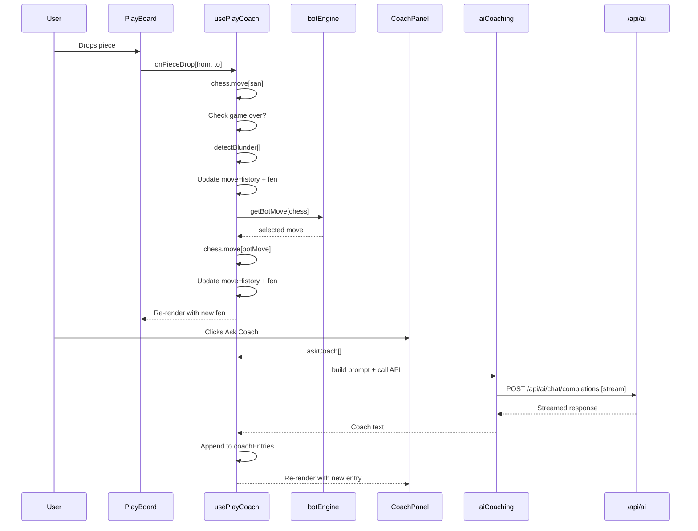

# Play vs Bot Coaching Feature — Architecture

## Overview

Replace the current game replay board with a **Play & Learn** tab where the user plays chess against a bot and receives real-time AI coaching that references patterns from their analyzed games. The existing Analysis tab with insight cards remains untouched.

---

## 1. Bot Move Generation — Decision

### Options Evaluated

| Option | Description | Pros | Cons |
|---|---|---|---|
| A — AI API | Send FEN to LLM, ask for next move | None meaningful | LLMs are unreliable at chess — illegal moves, hallucinated positions, slow, wastes API calls |
| B — chess.js random | Pick random legal move | Always legal, zero cost | Plays like a toddler — demoralizingly stupid, no coaching value |
| C — chess.js eval | Legal moves + material + positional scoring | Always legal, no API dependency, plays at beginner-intermediate level, fast | Not strong — but that is the point for coaching |
| D — stockfish.js | WASM chess engine | Best play strength | Heavy dependency, complex WASM setup, over-engineered for a coaching tool, too strong for learning |

### Decision: Option C — chess.js with basic evaluation

The bot's job is to be a **practice partner**, not a grandmaster. A beginner-intermediate bot creates realistic coaching scenarios: the user will make mistakes the coach can catch, and the bot will occasionally punish those mistakes with captures or simple tactics. Option C hits the sweet spot:

- Always legal — uses `chess.moves()` to get legal moves, then scores and picks
- No new dependencies — `chess.js` is already installed
- No API calls for moves — saves the AI budget for coaching feedback
- Appropriate strength — not so weak it is boring, not so strong it is demoralizing
- Simple to implement — a single function, no WASM, no workers

### Bot Evaluation Logic

Score each legal move on a 0–100 scale, then pick with weighted randomness (higher scores more likely, but not guaranteed — adds variety):

```
score = materialGain * 30           // capturing a queen = 270, a pawn = 30
      + checkBonus * 15             // giving check = +15
      + centerControl * 5           // moving to d4/d5/e4/e5 = +5
      + developmentBonus * 5        // moving a minor piece from back rank = +5
      + captureTowardCenter * 3     // recapturing toward center = +3
      + randomNoise * 8             // 0-8 random — prevents deterministic play
```

Then apply weighted random selection with a temperature factor. This produces a bot that:

- Captures hanging pieces most of the time (but occasionally misses one — realistic)
- Develops pieces and controls center in the opening
- Gives checks when available
- Varies its play across games
- Plays roughly at an 800–1200 Elo level — perfect for coaching

### Future Upgrade Path

If the user later wants a stronger bot, the evaluation function can be extended with:

- Piece-square tables for positional play
- Simple king safety scoring
- One-ply lookahead (consider opponent responses)

Or eventually swap in stockfish.js — the `getBotMove` function is the only seam, so the rest of the code does not change.

---

## 2. Real-Time Coaching Flow

### Trigger Strategy: On user request + auto-flag on blunders

Two coaching triggers:

1. **Ask Coach button** — User clicks anytime for feedback. Explicit, no annoyance.
2. **Auto-flag on blunders** — After each user move, run a lightweight local check. If the move was a clear blunder (hung piece, left king in check-free danger), show a small inline nudge: *Heads up — you might want to ask the coach about that move.* This does NOT fire an API call automatically. It just highlights the Ask Coach button.

Why not auto-coach every move:

- Too many API calls — slow and expensive
- Interrupts flow — constant loading kills the game feel
- User should feel in control of when they get help
- The auto-flag gives a gentle nudge without forcing anything

### Coaching API Call Design

When the user clicks Ask Coach (or after every 3 user moves if they prefer, controlled by a toggle), the app sends:

```
POST /api/ai/chat/completions

{
  model: "z-ai/glm-5.1",
  messages: [
    { role: "system", content: COACHING_SYSTEM_PROMPT },
    { role: "user", content: coachingUserPrompt }
  ],
  temperature: 0.8,
  stream: true
}
```

#### Data Sent in the Coaching Prompt

| Data | What | Why |
|---|---|---|
| Current FEN | Board state after user's last move | AI needs to see the position |
| Move history | SAN list of all moves played so far | AI can see the flow of the game |
| Analysis results | The 5 insight fields from `useAnalysis` | AI references the user's known patterns |
| Key game excerpts | 2-3 relevant PGN snippets from analyzed games | AI can say *this is the same pattern as your game against xplayer* |
| Last user move SAN | The move that triggered coaching | AI can comment specifically on it |

The prompt does NOT send all 30+ analyzed games. It sends the insight summaries (already concise) and 2-3 short PGN excerpts chosen by relevance (matching opening, similar position type). This keeps the token count reasonable.

### Coaching System Prompt

```
You are a chess coach watching a student play a game right now. You have already
analyzed their recent games and found these patterns:

COMMON MISTAKES: {commonMistakes}
WINNING PATTERNS: {winningPatterns}
HABITS TO STOP: {habitsToStop}
HABITS TO KEEP: {habitsToKeep}
VERDICT: {verdict}

Now they are playing a live game. Here is the current state:

MOVES SO FAR: {moveHistory}
CURRENT POSITION (FEN): {currentFen}
THEIR LAST MOVE: {lastMove}

RELEVANT PAST GAMES:
{gameExcerpts}

Give brief, specific coaching feedback. Rules:
- Reference their known patterns when relevant — "This looks like the same
  kingside weakness from your games against {opponent}"
- Be direct. If they made a bad move, say so and why.
- If the move was fine, acknowledge it briefly and point to what to watch for next.
- Keep it to 2-4 sentences. This is a live game, not a lecture.
- Do NOT give them the best move. Ask a question or describe the problem.
  They need to think, not be spoon-fed.
- If nothing notable happened, say something short like "Solid move. Keep going."
```

### Coaching Display: Scrollable Feed in a Sidebar

The coaching feedback appears in a **sidebar panel** next to the board — not a chat, not inline annotations. Each coaching entry is a timestamped card:

```
┌─────────────────────────┐
│ Move 12: e6             │
│                         │
│ You just pushed the f-  │
│ pawn again — same habit │
│ we flagged in your      │
│ games against pknight.  │
│ What piece did you      │
│ leave unprotected?      │
│                         │
│ 2 min ago               │
└─────────────────────────┘
```

The feed scrolls down as new entries appear. Old entries stay visible — the user can scroll up to review past feedback. This is better than a chat because:

- Each entry is tied to a specific move number — easy to connect to the board
- No conversational context management needed — each call is independent
- Old advice stays referenceable without scrolling through chaff

### Latency Handling

- Use **streaming** from the AI API — display text as it arrives, character by character
- Show a small **thinking indicator** (pulsing dot or "Coach is thinking...") while waiting for first token
- The game does NOT freeze — the user can keep playing while the coach thinks
- If the coach response arrives after more moves have been played, it still attaches to the move that triggered it (by move number)
- If the API call fails, show a subtle error inline: "Coach missed that one — try asking again." The game continues fine

### Blunder Detection (local, no API)

After each user move, run a lightweight check using `chess.js`:

1. Was the move a capture by the opponent on the next move that takes a higher-value piece? (Check if any hanging pieces exist after the move)
2. Did the move leave the king in a more vulnerable position? (Simple: count attackers near king)
3. Was a developed piece moved back to the back rank without a clear reason?

If any of these trigger, highlight the Ask Coach button with a gold pulse animation and show a small toast: *"That might have been a mistake — ask the coach?"*

This is intentionally simple and will have false positives. That is fine — it is a nudge, not a verdict.

---

## 3. Tab UI in ResultsView

### Current State

[`ResultsView.jsx`](src/components/ResultsView.jsx) renders insight cards + GameReplay in a single vertical flow. No tabs exist.

### New Structure

```
┌──────────────────────────────────────────────┐
│  Report for username                         │
│  Your games, honest feedback, no sugarcoating│
├──────────────────────────────────────────────┤
│  [ Analysis ]  [ Play & Learn ]              │  ← tab bar
├──────────────────────────────────────────────┤
│                                              │
│  (tab content goes here)                     │
│                                              │
├──────────────────────────────────────────────┤
│  [ Analyze Another Player ]                  │
└──────────────────────────────────────────────┘
```

### Tab Styling

- Two tabs side by side, left-aligned
- Active tab: gold bottom border (`#c8a96e`), cream text (`#d4c8b8`)
- Inactive tab: muted text (`#7a6f62`), no border, subtle hover to `#9a8e7e`
- Tab bar has a bottom border (`#3d3530`) that the active tab's gold border overlaps
- No background color difference between tabs — clean, minimal
- Font: Inter, 0.9rem, font-weight 500
- Tabs are just buttons — no routing, no URL changes, just local state

### ResultsView Changes

The `results` and `games` props stay. A new `activeTab` state is added:

```jsx
const [activeTab, setActiveTab] = useState('analysis')

// In render:
<header>...</header>
<nav className={styles.tabBar}>
  <button className={activeTab === 'analysis' ? styles.tabActive : styles.tab}
          onClick={() => setActiveTab('analysis')}>Analysis</button>
  <button className={activeTab === 'play' ? styles.tabActive : styles.tab}
          onClick={() => setActiveTab('play')}>Play & Learn</button>
</nav>

{activeTab === 'analysis' && (
  <div className={styles.sections}>
    {sections.map(...)}
  </div>
)}

{activeTab === 'play' && (
  <PlayCoach results={results} games={games} username={username} />
)}
```

The existing insight cards and their layout are completely unchanged. The GameReplay component is removed from ResultsView — it only lived under the old flat layout.

---

## 4. Board Styling

### Current Problems

The current board in [`ChessBoard.jsx`](src/components/ChessBoard/ChessBoard.jsx) uses:

- `customDarkSquareStyle: { backgroundColor: '#5c4a3a' }` — too flat, looks muddy
- `customLightSquareStyle: { backgroundColor: '#c8a96e' }` — too saturated gold, clashes
- No custom pieces — using default react-chessboard SVGs which look generic
- Board wrapped in a plain dark div with minimal styling

### New Board Design

#### Square Colors

Replace the current muddy/oversaturated pair with a refined earthy palette:

| Square | Color | Rationale |
|---|---|---|
| Light | `#d4c4a8` | Warm sand — clearly distinct from dark but not screaming gold |
| Dark | `#8b7355` | Rich walnut — visible contrast, earthy, not muddy |
| Last move highlight | `rgba(200,169,110,0.35)` | Gold tint — ties to accent color without overwhelming |
| Check highlight | `rgba(184,92,60,0.5)` | Terracotta — matches the error/negative accent from the design system |
| Legal move dot | `rgba(200,169,110,0.25)` | Subtle gold dot — standard react-chessboard feature |

#### Piece Set

Use `react-chessboard`'s `customPieces` prop with a **staunton-style SVG set** stored in `public/pieces/`. The standard react-chessboard pieces are fine but the default set is a bit thin. Options:

- **Best option**: Use the built-in pieces from react-chessboard but with the `customDarkSquareStyle`/`customLightSquareStyle` changes above — the pieces actually look fine on better square colors
- **Upgrade option**: Replace with [lichess piece SVGs](https://github.com/lichess-org/lila/tree/master/public/piece) (Cburnett set) — these are the gold standard for web chess, MIT licensed, already in SVG format

Start with the first option (just fix the squares). If the user still hates the pieces, swap to Cburnett as a follow-up. No over-engineering on day one.

#### Board Container

```css
.boardContainer {
  display: flex;
  flex-direction: column;
  align-items: center;
  gap: 0.75rem;
}

.boardFrame {
  padding: 8px;
  background: #1a1714;
  border: 1px solid #3d3530;
  border-radius: 6px;
  box-shadow: 0 4px 20px rgba(0,0,0,0.4);
}
```

#### Board Width

Use `react-chessboard`'s responsive behavior. Set `boardWidth` based on container measurement (same pattern as current `GameReplay`). On desktop the board area is ~480px. On mobile it fills the available width minus padding.

#### Player Labels

Add simple player labels above and below the board:

```
  Bot (Black)          ← muted, small
  ┌──────────────┐
  │              │
  │    board     │
  │              │
  └──────────────┘
  You (White)           ← cream, small
```

Font: Inter, 0.8rem. Bot name in `#7a6f62`, user name in `#d4c8b8`.

---

## 5. Component Structure

### Component Tree

```
ResultsView
├── Tab Bar (inline in ResultsView)
├── Analysis Tab (existing insight cards — unchanged)
│   ├── InsightCard (verdict)
│   ├── InsightCard (commonMistakes)
│   ├── InsightCard (habitsToStop)
│   ├── InsightCard (winningPatterns)
│   └── InsightCard (habitsToKeep)
└── PlayCoach (new)
    ├── PlayBoard
    │   ├── PlayerLabel (bot)
    │   ├── Chessboard (react-chessboard — interactive)
    │   └── PlayerLabel (user)
    ├── MoveList
    ├── CoachPanel
    │   ├── CoachEntry (repeated)
    │   └── AskCoachButton (+ blunder pulse state)
    └── GameControls
        ├── NewGame
        ├── Resign
        └── Undo (optional — skip if over-engineering concern)
```

### New Files to Create

| File | Purpose |
|---|---|
| `src/components/PlayCoach/PlayCoach.jsx` | Main Play & Learn tab component. Layout: board left, coach panel right on desktop; stacked on mobile |
| `src/components/PlayCoach/PlayCoach.module.css` | Layout styles for the play view |
| `src/components/PlayBoard/PlayBoard.jsx` | Interactive chessboard wrapper. Handles piece drops, board styling, player labels |
| `src/components/PlayBoard/PlayBoard.module.css` | Board frame and player label styles |
| `src/components/MoveList/MoveList.jsx` | Scrollable SAN move list for the current game. Clicking a move highlights it |
| `src/components/MoveList/MoveList.module.css` | Move list styles |
| `src/components/CoachPanel/CoachPanel.jsx` | Scrollable feed of coach entries + Ask Coach button |
| `src/components/CoachPanel/CoachPanel.module.css` | Coach panel styles |
| `src/components/CoachPanel/CoachEntry.jsx` | Single coaching message card (move number, text, timestamp) |
| `src/components/CoachPanel/CoachEntry.module.css` | Entry card styles |
| `src/components/GameControls/GameControls.jsx` | New Game / Resign buttons |
| `src/components/GameControls/GameControls.module.css` | Button styles |
| `src/hooks/usePlayCoach.js` | All play-vs-bot state and logic: chess instance, move handling, bot moves, coaching calls |
| `src/services/botEngine.js` | `getBotMove(chessInstance)` — the evaluation + weighted random selection function |
| `src/services/aiCoaching.js` | `askCoach(fen, moveHistory, lastMove, analysisResults, gameExcerpts)` — builds prompt, calls API, returns text |

### Files to Delete

| File | Reason |
|---|---|
| `src/components/GameReplay/GameReplay.jsx` | Replaced by PlayCoach |
| `src/components/GameReplay/GameReplay.module.css` | Replaced by PlayCoach |
| `src/components/GameList/GameList.jsx` | Part of old replay — not needed in new design |
| `src/components/GameList/GameList.module.css` | Same |
| `src/components/MoveControls/MoveControls.jsx` | Part of old replay — new design has MoveList |
| `src/components/MoveControls/MoveControls.module.css` | Same |
| `src/components/ChessBoard/ChessBoard.jsx` | Replaced by PlayBoard (interactive version) |
| `src/components/ChessBoard/ChessBoard.module.css` | Replaced by PlayBoard styles |
| `src/hooks/useGameReplay.js` | Replaced by usePlayCoach |

The old `ChessBoard/`, `GameReplay/`, `GameList/`, `MoveControls/` directories and their empty parent folders can be deleted entirely.

### Files to Modify

| File | Change |
|---|---|
| `src/components/ResultsView.jsx` | Add `activeTab` state, tab bar, conditional rendering of Analysis vs PlayCoach. Remove GameReplay import. Add PlayCoach import. |
| `src/components/ResultsView.module.css` | Add `.tabBar`, `.tab`, `.tabActive` styles |
| `src/services/aiAnalysis.js` | No changes needed — the coaching service is a separate file |
| `vite.config.js` | No changes needed — the proxy already forwards `/api/ai/chat/completions` and that same endpoint is used for coaching calls |

---

## 6. State Management — `usePlayCoach` Hook

### Why a Separate Hook

The existing [`useAnalysis`](src/hooks/useAnalysis.js) manages the analysis pipeline (fetch games → call AI → store results). That is a one-shot flow with a clear lifecycle (idle → loading → results → error).

The play-vs-bot state is fundamentally different:

- It is interactive and ongoing (game in progress, moves being made)
- It has its own chess instance separate from analysis
- It manages coaching calls that happen mid-game
- It has game lifecycle (playing → checkmate → draw → new game)

Mixing these into `useAnalysis` would violate single responsibility and make both harder to understand. Keep them separate.

### Hook Interface

```js
function usePlayCoach(analysisResults, games) {
  // Returns:
  return {
    // Game state
    fen,                  // current board position
    moveHistory,          // array of SAN strings
    isCheck,              // boolean
    isCheckmate,          // boolean
    isDraw,               // boolean
    isStalemate,          // boolean
    isGameOver,           // boolean
    gameResult,           // string like "1-0", "0-1", "1/2-1/2"
    turnColor,            // "white" or "black"

    // Actions
    onPieceDrop,          // (sourceSquare, targetSquare) => boolean — called by react-chessboard
    newGame,              // () => void — reset and start fresh
    resign,               // () => void — forfeit

    // Bot
    isBotThinking,        // boolean — brief delay while bot picks move

    // Coaching
    coachEntries,         // array of { moveNumber, san, text, timestamp }
    isCoachThinking,      // boolean — AI call in progress
    askCoach,             // () => void — trigger coaching call
    blunderFlagged,       // boolean — true if last move looks like a blunder
  }
}
```

### Internal State

```
chessRef        = useRef(new Chess())    // the game instance — mutated directly
[moveHistory, setMoveHistory]            // SAN array for display
[coachEntries, setCoachEntries]          // coaching feed
[isBotThinking, setIsBotThinking]        // bot move delay
[isCoachThinking, setIsCoachThinking]    // API call in progress
[blunderFlagged, setBlunderFlagged]      // local blunder detection result
[gameStatus, setGameStatus]              // ongoing / checkmate / draw / resigned
```

### Data Flow Diagram



### Interaction with Analysis State

`usePlayCoach` receives `analysisResults` and `games` as arguments. It uses these for:

1. Injecting pattern summaries into the coaching prompt
2. Finding relevant game excerpts to send with coaching requests

It does NOT mutate analysis state. The analysis results are read-only reference material for the coach.

### Bot Move Timing

After the user moves, add a 300–600ms random delay before the bot moves. This feels more natural than an instant response. During this delay `isBotThinking` is true — could show a small indicator on the bot's player label.

---

## 7. Coaching Service — `aiCoaching.js`

### Function Signature

```js
async function askCoach({ fen, moveHistory, lastMove, analysisResults, gameExcerpts, onText, signal })
```

- `onText` — callback for streaming text chunks (enables character-by-character rendering)
- `signal` — AbortController signal for cancellation (user clicks Ask Coach again before previous response finishes)

### Streaming Implementation

The Vite proxy already forwards the response body as-is. For streaming, the proxy needs a small modification to support `stream: true` in the request body — the upstream API returns `text/event-stream` and the proxy should pipe that through.

However, **streaming through the proxy is complex** (requires handling SSE in the Node middleware). A simpler approach for v1:

- **Skip streaming in v1**. Wait for the full response, then display it.
- Show the "Coach is thinking..." indicator during the wait.
- The coaching text is only 2-4 sentences — it arrives quickly (2-5 seconds).
- Add streaming as a polish step later if the wait feels too long.

This avoids over-engineering the proxy on day one.

### Relevant Game Excerpt Selection

From the analyzed `games` array, pick 2-3 PGN excerpts that are most relevant:

1. If the current opening matches a past game's ECO code, include that game
2. If the user's analysis flagged a specific opponent, include a game against that opponent
3. Fall back to the first 2 games if no specific match

Each excerpt is truncated to the first 20 moves (40 half-moves) — enough to show the opening and early middlegame, which is where most coaching happens.

### Error Handling

- If the coaching API call fails, return a fallback message: *"Coach couldn't analyze that move. Try again?"*
- If the response is unparseable (not text), return the same fallback
- The game never breaks — coaching is always additive, never blocking
- Rate limit errors (429) show: *"Coach needs a moment — too many requests. Try again shortly."*

---

## 8. Layout and Responsive Design

### Desktop (width > 768px)

```
┌─────────────────────────────────────────────────────────┐
│  PlayBoard          │  CoachPanel                       │
│  ┌────────────┐     │  ┌─────────────────────────────┐ │
│  │ Bot (Black)│     │  │ Ask Coach  [button]         │ │
│  └────────────┘     │  │                             │ │
│  ┌────────────┐     │  │ ┌─────────────────────────┐│ │
│  │            │     │  │ │ Move 8: Nc3             ││ │
│  │   board    │     │  │ │ Good development —      ││ │
│  │   480px    │     │  │ │ same knight move that    ││ │
│  │            │     │  │ │ worked in your win vs    ││ │
│  └────────────┘     │  │ │ chessmaster99.           ││ │
│  ┌────────────┐     │  │ └─────────────────────────┘│ │
│  │ You (White)│     │  │                             │ │
│  └────────────┘     │  │ ┌─────────────────────────┐│ │
│                     │  │ │ Move 12: e6             ││ │
│  ┌────────────┐     │  │ │ You pushed that f-pawn  ││ │
│  │ MoveList   │     │  │ │ again...                ││ │
│  │ 1. e4 e5   │     │  │ └─────────────────────────┘│ │
│  │ 2. Nf3 Nc6 │     │  └─────────────────────────────┘ │
│  │ ...         │     │                                  │
│  └────────────┘     │  ┌─────────────────────────────┐ │
│                     │  │ [New Game]  [Resign]         │ │
│  ┌────────────┐     │  └─────────────────────────────┘ │
│  │ GameControls│    │                                  │
│  └────────────┘     │                                  │
└─────────────────────┴──────────────────────────────────┘
```

Two-column grid: board column (auto width, max 520px) + coach column (1fr).

### Mobile (width <= 768px)

Stack vertically: board full width → move list → game controls → coach panel below.

The coach panel on mobile expands to full width below the board. The Ask Coach button stays sticky at the bottom of the screen for easy access.

---

## 9. File Change Summary

### New Files (13)

```
src/components/PlayCoach/PlayCoach.jsx
src/components/PlayCoach/PlayCoach.module.css
src/components/PlayBoard/PlayBoard.jsx
src/components/PlayBoard/PlayBoard.module.css
src/components/MoveList/MoveList.jsx
src/components/MoveList/MoveList.module.css
src/components/CoachPanel/CoachPanel.jsx
src/components/CoachPanel/CoachPanel.module.css
src/components/CoachPanel/CoachEntry.jsx
src/components/CoachPanel/CoachEntry.module.css
src/components/GameControls/GameControls.jsx
src/components/GameControls/GameControls.module.css
src/hooks/usePlayCoach.js
src/services/botEngine.js
src/services/aiCoaching.js
```

### Deleted Files (8)

```
src/components/GameReplay/GameReplay.jsx
src/components/GameReplay/GameReplay.module.css
src/components/GameList/GameList.jsx
src/components/GameList/GameList.module.css
src/components/MoveControls/MoveControls.jsx
src/components/MoveControls/MoveControls.module.css
src/components/ChessBoard/ChessBoard.jsx
src/components/ChessBoard/ChessBoard.module.css
src/hooks/useGameReplay.js
```

### Modified Files (2)

```
src/components/ResultsView.jsx        — add tabs, swap GameReplay for PlayCoach
src/components/ResultsView.module.css — add tab bar styles
```

### Unchanged Files

Everything else stays the same — `App.jsx`, `useAnalysis.js`, `aiAnalysis.js`, `vite.config.js`, all insight card components, form components, etc.

---

## 10. Implementation Order

This is the recommended build sequence. Each step produces something testable.

1. **`botEngine.js`** — Write and test the bot move evaluation function in isolation. Feed it FENs, verify it picks reasonable moves.

2. **`usePlayCoach.js`** — Build the hook with chess.js game logic, piece drop handling, bot move integration, and game lifecycle. Test by logging state changes.

3. **`PlayBoard/`** — Create the interactive board component. Wire `onPieceDrop` to the hook. Verify user can play moves and the bot responds.

4. **`MoveList/`** — Add the move list display below the board.

5. **`GameControls/`** — Add New Game and Resign buttons.

6. **`PlayCoach/`** — Compose PlayBoard + MoveList + GameControls into the main layout.

7. **Tab bar in `ResultsView`** — Add the tab switching UI. Wire PlayCoach into the Play & Learn tab. Delete old GameReplay reference.

8. **Delete old components** — Remove GameReplay, GameList, MoveControls, ChessBoard, useGameReplay.

9. **`aiCoaching.js`** — Build the coaching API service with prompt construction, streaming support, and error handling.

10. **`CoachPanel/` + `CoachEntry/`** — Build the coaching feed UI and Ask Coach button.

11. **Blunder detection** — Add the lightweight local blunder check in `usePlayCoach` and the Ask Coach button pulse animation.

12. **Board styling polish** — Finalize square colors, piece rendering, board frame, responsive breakpoints.

13. **Mobile layout** — Stack layout for narrow screens, sticky Ask Coach button.

---

## 11. Key Risks and Mitigations

| Risk | Mitigation |
|---|---|
| AI coaching call fails or times out | Fallback message, game continues. Coach is never blocking. |
| AI gives bad chess advice | The coaching prompt explicitly says "do NOT give them the best move" — the AI should coach, not engine-analyze. Accept that occasional bad advice is part of LLM coaching. |
| Bot plays too weakly | Tunable: increase the randomNoise weight to reduce blunders, add piece-square tables. The bot is meant to be a practice partner, not Carlsen. |
| API rate limits from frequent coaching calls | Ask Coach is user-triggered, not automatic. Add a 10-second cooldown between calls. Show a message if rate-limited. |
| Token cost from sending game excerpts | Limit to 2-3 excerpts, 20 moves each. The insight summaries are already compact. Total coaching prompt should be under 2000 tokens. |
| react-chessboard drag-and-drop bugs | Use the library's `onPieceDrop` prop as documented. Test on mobile — react-chessboard supports touch events. |
| Streaming through Vite proxy is complex | Skip streaming in v1. Full response mode works fine for 2-4 sentence coaching. Add streaming later if needed. |
